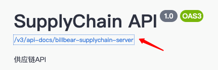

# swagger api 生成器

# 准备

## swagger.config.json

修改 swagger.config.json 中的 url, 点击箭头链接，复制浏览器中的地址



```json
{
  "url": "swagger api json",
  "dir": "./src/lib",
  "language": "typescript"
}
```

## config.ts

修改 baseURL

```js
const baseConfig: AxiosRequestConfig = {
  baseURL: '/api',
};
```

## push.js

输入你 npm 库对应的信息

```js
npmLogin('npm账号', 'npm密码', '邮箱', 'npm仓库地址');
// 省略
shelljs.exec('npm publish --registry=npm仓库地址');
```

## 安装

```shell
  npm i
```

## 更新接口

```shell
  npm run swagger-pull
```

## 发布 npm 包

```shell
  npm run swagger-push
```

## 注意事项

使用前确认文档地址

[生成器](https://github.com/hosseinmd/swagger-typescript)
[配置](swagger.config.json)
